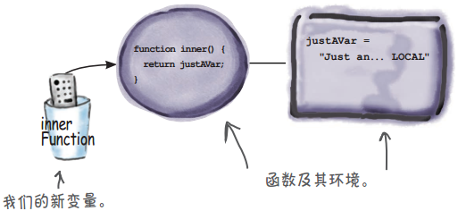
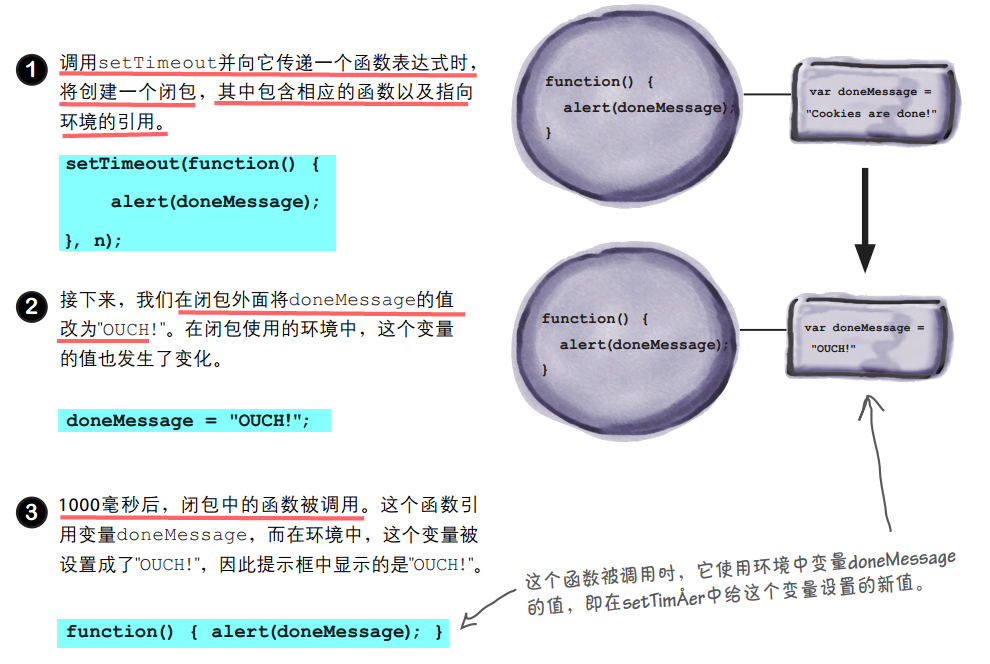

# 《Head First JavaScript》读书笔记
---

# Chapter10 函数

### 函数声明:
```javascript
function quack(num) {
  for (var i = 0; i < num; i++) {
    console.log("Quack!");
  }
}
quack(3);
```

### 函数表达式:
```javascript
var fly = function(num) {
  for (var i = 0; i < num; i++) {
    console.log("Flying!");
  }
};
fly(3);
```

### 函数声明 VS 函数表达式
1. 浏览器总是首先扫描代码，在其中查找函数声明。  
函数声明不返回指向函数的引用；  
2. 找到函数声明时，浏览器创建相应的变量，并将得到的函数引用赋给与函数同名的变量
3. 处理所有的函数声明后，浏览器回到代码开头，开始按从头到尾的顺序执行代码。函数表达式随其他代码一起被处理    
函数表达式返回一个引用， 该引用指向函数表达式创建的函数。


结果为一个值的任何东西都是表达式  
函数表达式的结果是一个函数引用

函数声明是一条语句。
它包含一条隐藏的赋值语句，这条语句将函数引用赋给一个变量。

函数表达式不自动将函数引用赋给任何变量，你必须显式地这样做。

### 作为一等公民的函数的特征
* 将函数赋给变量
* 将函数传递给函数
* 从函数返回函数

# Chapter11 匿名函数、作用域和闭包

### 匿名（ anonymous）
指的是没有名称的函数。
通过使用匿名函数，可让代码更简洁精练，可读性更强，效率更高，甚至更易于维护
```javascript
setTimeout(function() {
	    alert("Time to take the cookies out of the oven");
	  }, 600000);
```

在需要函数引用的地方，都可使用函数表达式，因为其结果就是一个函数引用。  
如果需要将一个函数作为实参，可将实参指定为函数表达式。  
同样，如果需要从函数返回一个函数，也可返回一个函数表达式。  


可将函数声明放在任何地方，且可在任何地方调用它们。在代码的任何地方，函数声明创建的函数都是已定义的，这被称为 `提升（ hoisting）`

函数表达式显然不同，它创建的函数要等到它执行后才被定义。


### 嵌套函数
在代码顶层定义的函数与在函数中定义的函数之间的唯一差别在于，它们的作用域不同。

在代码顶层定义的函数是全局的，而在函数中定义的函数是局部的

### 词法作用域 
JavaScript的作用域规则完全基于代码的结构，而不是一些动态的运行阶段属性
词法作用域的**优点**: 总是可以通过查看代码来确定变量是在哪里定义的，进而确定它的值。

```javascript
var justAVar = "Oh, don't you worry about it, I'm GLOBAL";
function whereAreYou() {
  var justAVar = "Just an every day LOCAL";
  function inner() {
    return justAVar;
  }
  return inner;
}
var innerFunction = whereAreYou();
var result = innerFunction();
console.log(result);
```
所有的局部变量都存储在一个`环境（ environment）`中。  
**环境**:它存储了在局部作用域内定义的所有变量。
可将形参视为函数的局部变量，因此它们也包含在环境中。

当我们返回函数inner时， 返回的不仅仅是函数，还有与之相关联的环境。

```javascript
var innerFunction = whereAreYou();
```
这条语句执行完毕后， 我们就有了变量innerFunction， 它指向whereAreYou返回的函数（ 及其环境）。   


```javascript
var result = innerFunction();
```
调用innerFunction。 这将在相应的环境中执行它指向的函数的代码   


每个嵌套函数都有自己的小环境，其中包含它自己的变量。这样将形成一个环境链，从内到外依次为各个嵌套函数的环境。

在环境中查找变量时，你将从最近的环境着手，沿环境链不断往下查找，直到找到变量为止。如果在环境链中没有找到，再在全局环境中查找。

### 闭包 = 函数 + 其引用环境
`闭包` = 包含自由变量的函数 + 为所有这些自由变量提供了变量绑定的环境 

是极其强大的编程工具。   
闭包捕获其创建时所处作用域内的变量的值。

**局部变量**: 在函数体中定义的，包括所有的形参      
**自由变量**: 不是在本地定义的变量  


### 使用闭包实现神奇的计数器
没有使用闭包：  
```javascript
var count = 0;
function counter() {
  count = count + 1;
  return count;
}
console.log(counter());
```
问题是，使用全局变量count，协作开发代码时，大家常常会使用相同的变量名，进而导致冲突。


可以使用受保护的局部变量实现计数器。这样，计数器将不会与任何代码发生冲突，且只能通过调用相应的函数（也叫闭包）来增加计数器的值:
```javascript
function makeCounter() {
  var count = 0;
  function counter() {
    count = count + 1;
    return count;
  }
  return counter;
}
var doCount = makeCounter();
console.log(doCount())
```
在函数makeCounter中声明变量count。这样它就是局部变量， 而不是全局变量。  
这是一个闭包，在其环境中存储了变量count。  

### 通过将函数表达式用作实参来创建闭包
```javascript
function makeTimer(doneMessage, n) {
  setTimeout(function() {
    alert(doneMessage);
  }, n);
}
makeTimer("Cookies are done!", 1000);
```
方法setTimeout存储该函数引用（这是一个函数及其环境，即闭包），并在1000毫秒后调用它。   
我们传递给setTimeout的函数是一个闭包，因为它带有将自由变
量doneMessage绑定到字符串 Cookies are done! 的环境。


### 闭包包含的是实际环境，而非环境的副本
如果闭包函数外面的代码修改了变量，闭包函数执行时看到的将是变量的新值。
```javascript
function setTimer(doneMessage, n) {
  setTimeout(function() {
    alert(doneMessage);
  }, n);
  doneMessage = "OUCH!";
}
setTimer("Cookies are done!", 1000);
```
   

# Chapter12 对象

## 对象字面量创建对象
逐个地指定其属性：
```javascript
var taxi = {
  make: "Webville Motors",
  model: "Taxi",
  year: 1955,
  color: "yellow",
  passengers: 4,
  convertible: false,
  mileage: 281341,
  started: false,

  start: function() { this.started = true; },
  stop: function() { this.started = false; },
  drive: function() {
    // 方法drive的代码
  }
};
```
对象字面量提供了一个便利方式，让你能够在代码中随时随地创建对象 ，    
但需要创建大量对象（如一个出租车车队）时，你不想输入数百个对象字面量，不是吗？


## 对象构造函数
犹如一个小型工厂，能够创建无数类似的对象。  
从代码的角度看，构造函数很像**返回对象的函数**：  
定义后，每当需要创建新对象时都可调用它。  

像饼干模具的对象创建方式，可帮助创建基本结构相同的对象。   
这样，创建的所有对象都将看起来一样，它们包含在一个地方定义的所有属性和方法。

### 创建构造函数
step1: 先定义一个构造函数  
step2: 再使用它来创建对象  

给构造函数命名时，采用了首字母大写的方式。    
并非必须这样做，但人人都将此视为一种约定加以遵守。   
让开发人员能够一眼就看出哪些函数是构造函数，哪些函数是常规函数。 
```javascript
function Dog(name, breed, weight) {
  this.name = name;
  this.breed = breed;
  this.weight = weight;
}
```
函数的形参对应于要给每个小狗对象提供的属性。   
属性名和形参名不必相同，但通常相同——这也是约定。   
出于提高清晰度的考虑，常常让形参与属性同名。   
这样只需查看构造函数的定义，就知道要给哪些属性赋值。       
这个构造函数什么都没有返回。    

创建一个名称为Fido、 品种为Mixed、体重为38磅的小狗对象：  
```javascript
var fido = new Dog("Fido", "Mixed", 38);
```

通过这种方式创建小狗对象，可确保每个小狗对象都包含相同的属性： name、 breed和weight。

## 构造函数的工作原理

1. new首先创建一个新的空对象。
2. 接下来，new设置this，使其指向这个新对象。   
this存储了一个引用，指向代码当前处理的对象。
3. 调用函数Dog，并将Fido、Mixed 和38作为实参传递给它。
4. 执行这个函数的代码。Dog给新创建的this对象的属性赋值。
5. Dog函数执行完毕后，运算符new返回this——指向新创建的对象的引用。  
请注意，它会自动为你返回this，你无需在代码中显式地返回。    
指向新对象的引用被返回后，我们将其赋给变量fido。

对象创建后，当你对其调用方法时，this被设置为方法被调用的对象。   
因此，在方法中，this总是表示方法被调用的对象。


## 向构造函数添加方法
在对象中，方法也是属性，只是将函数赋给了这种属性。  
```javascript
function Dog(name, breed, weight) {
  this.name = name;
  this.breed = breed;
  this.weight = weight;
  this.bark = function() {
    if (this.weight > 25) {
      alert(this.name + " says Woof!");
    } else {
      alert(this.name + " says Yip!");
    }
  };
}
```
测试bark方法：  
```javascript
var fido = new Dog("Fido", "Mixed", 38);
var fluffy = new Dog("Fluffy", "Poodle", 30);
var spot = new Dog("Spot", "Chihuahua", 10);
var dogs = [fido, fluffy, spot];
for (var i = 0; i < dogs.length; i++) {
  dogs[i].bark();
}
```

## 创建对象时，忘了使用关键字new
```javascript
function Album(title, artist, year) {
  this.title = title;
  this.artist = artist;
  this.year = year;
  this.play = function() {
    // 其他代码
  };
}
var darkside = Album("Dark Side of the Cheese","Pink Mouse", 1971);
darkside.play();
```
构造函数也是函数，不使用关键字new也能够调用它。   
但调用构造函数时如果忘记了使用new，可能导致代码出现难以找出的bug。  
```
Uncaught TypeError: Cannot call method 'play' of undefined
```

## new
一个与构造函数一起用来创建对象的运算符。   
运算符对操作数进行操作。   
new只操作一种操作数，那就是函数调用。  

## 用对象字面量替代实参
构造函数Car包含大量的形参，难以阅读和维护。  
另外，调用这个构造函数的代码编写起来也比较困难。   
```javascript
function Car(make, model, year, color, passengers, convertible, mileage) {
  this.make = make;
  this.model = model;
  this.year = year;
  this.color = color;
  this.passengers = passengers;
  this.convertible = convertible;
  this.mileage = mileage;
  this.started = false;
  this.start = function() {
    this.started = true;
  };
  // 其他方法
}
var cadi = new Car("GM", "Cadillac", 1955, "tan", 5, false, 12892);
```

**工作原理：**   
将所有实参都放到一个对象字面量中，再将这个对象字面量传递给函数。  
这将通过一个容器（对象字面量）传递所有的值，从而不必操心实参与形参的顺序问题。

1. 对于调用构造函数Car的代码，可重写为下面这样：  
```javascript
var cadiParams = {make: "GM",
                  model: "Cadillac",
                  year: 1955,
                  color: "tan",
                  passengers: 5,
                  convertible: false,
                  mileage: 12892};
var cadi = new Car(cadiParams);
```
只需将所有实参都存储到对象字面量的恰当属性中即可。   我们使用了构造函数使用的属性名。

2. 修改构造函数Car
* 将构造函数Car的7个形参替换为1个，用于表示要传入的对象。   
* 将每个形参引用都替换为传递给函数的对象的相应属性。
* 在方法中,没有直接使用形参。  
这合乎情理，因为在方法中应总是通过关键字this使用对象的属性。  
因此，这些代码无需作任何修改。  
```javascript
function Car(params) {
  this.make = params.make;
  this.model = params.model;
  this.year = params.year;
  this.color = params.color;
  this.passengers = params.passengers;
  this.convertible = params.convertible;
  this.mileage = params.mileage;
  this.started = false;
  this.start = function() {
    this.started = true;
  };
  this.stop = function() {
    this.started = false;
  };
  this.drive = function() {
    if (this.started) {
      alert("Zoom zoom!");
    } else {
      alert("You need to start the engine first.");
    }
  };
}
```

## 确定对象是哪种类型——由哪个构造函数创建
在JavaScript中，对象是一个动态的结构，无论对象包含哪些属性和方法，其类型都是object。   
运算符`typeof`返回其操作数的类型。

每当你使用运算符new调用构造函数时，都将创建一个新的对象实例。   
如果你使用构造函数Car创建一个对象，这个对象就是汽车；   
更准确地说，这个对象就是一个Car实例。

使用运算符`instanceof`来确定对象是由哪个构造函数创建的。   
```javascript
var cadiParams = {make: "GM", model: "Cadillac", year: 1955,   
 color: "tan", passengers: 5, convertible: false, mileage: 12892};
var cadi = new Car(cadiParams);
if (cadi instanceof Car) {
  console.log("Congrats, it's a Car!");
};
```
如果对象是由指定的构造函数创建的，运算符instanceof将返回true。

创建对象时，运算符new在幕后存储了一些信息，让你随时都能确定对象是由哪个构造函数创建的。   
运算符instanceof就是根据这些信息来确定对象是否是指定构造函数的实例。

## 修改用构造函数创建的对象
使用构造函数创建对象后，可对其进行修改，   
因为使用构造函数创建的对象是可以修改的。

对象字面量创建的对象，可在对象创建后增删其属性。   
对于使用构造函数创建的对象，也可这样做。

使用构造函数Dog创建的小狗对象fido。
```javascript
var fido = new Dog("Fido", "Mixed", 38);
```
给这个对象添加新属性， 只需给这个新属性赋值即可。   
可使用运算符`delete`删除既有的属性。  
```javascript
fido.owner = "Bob";
delete fido.weight;
```
添加新方法,只需将这个方法赋给一个新属性：
```javascript
fido.trust = function(person) {
    return (person === "Bob");
};
```
这只修改了对象fido。如果给对象fido添加一个方法，那么只有fido对象有这个方法，其他小狗对象都不会包含这个方法。   

修改汽车对象后，它依然是汽车对象。  
通常，你不会使用构造函数来创建一个对象，再将它修改得面目全非，看起来根本不像是使用这个构造函数创建的。   
一般而言，你使用构造函数来创建相当一致的对象；   
但如果你希望对象更灵活，JavaScript也提供了这样的支持。

## 内置构造函数
JavaScript自带了一系列构造函数，可用于实例化一些便利的对象，  
如知道如何处理日期和时间的对象、擅于在文本中查找模式的对象以及颠覆你对数组的认识的对象。   

### 日期对象
```javascript
var now = new Date();
```
构造函数`Date`返回一个表示本地当前日期和时间的Date实例。

可使用其方法来操作日期和时间，还可获取其各种属性。
```javascript
var dateString = now.toString();  //返回一个表示日期的字符串,如“Thu Feb 06 2014 17:29:29 GMT-0800 (PST)”。
var theYear = now.getFullYear();  //返回日期中的年份
var theDayOfWeek = now.getDay();  //返回一个数字，指出日期对象表示的是星期几，如1（表示星期一）
```

通过向构造函数Date传递额外的实参，创建表示任何日期和时间的日期对象。
```javascript
var birthday = new Date("May 1, 1983");  //创建一个表示1983年5月1日的日期对象
var birthday = new Date("May 1, 1983 08:03 pm");  //在传入的字符串中包含时间，从而创建更具体的日期对象
```

### 数组对象
#### 创建数组
1. 使用构造函数来创建：  
```javascript
var emptyArray = new Array();  //创建一个长度为零的空数组。
emptyArray[0] = 99;  //添加元素
```

创建特定长度的数组对象   
```javascript
var oddNumbers = new Array(3);  //创建一个包含3个元素的数组
oddNumbers[0] = 1;
oddNumbers[1] = 3;
oddNumbers[2] = 5;
```

2. 方括号表示法（ []）,这实际上是直接使用构造函数Array的简写。
```javascript
var items = [];
var items = ["a", "b", "c"];  //数组字面量语法。
```
等同于：
```javascript
var items = new Array();
var items = new Array("a", "b", "c");  //如果传入了多个实参，创建的数组将以这些值作为元素。
```

#### 数组对象方法
```javascript
oddNumbers.reverse();  //按相反的顺序排列数组的所有元素（ 现在数组oddNumber依次包含5、 3和1）,这个方法修改原始数组。
var aString = oddNumbers.join(" - ");  //将数组oddNumbers中的值合并成一个字符串（这里在值之间加上-）， 并返回这个字符串。 返回字符串 “5 - 3 - 1”
var areAllOdd = oddNumbers.every(function(x) {
  return ((x % 2) !== 0);
});   
//方法every将一个函数作为参数；
//对于数组中的每个值，都调用这个函数，并判断该函数返回的值是true还是false。
//如果对于所有的元素，这个函数都返回true，那么方法every将返回true。
```

#### 字面量表示法 VS 构造函数创建对象

字面量表示法和构造函数创建的对象没什么两样。   
无论使用哪种方式创建对象后，都可使用其方法。   

创建简单数组时，使用数组字面量语法的效果很好；    
创建要等到运行阶段才能确定长度的数组时，用构造函数Array更合适。

```javascript
//可能创建一个很大的数组，其长度要等到运行阶段才知道。
var n = getNumberOfWidgetsFromDatabase();
var widgets = new Array(n);
for(var i=0; i < n; i++) {
  widgets[i] = getDatabaseRecord(i);
}
```

### 其他内置对象
* Object 你可使用构造函数Object来创建对象。与数组一样，对象字面量表示法{}与new Object()等价。   
* Math 这个对象包含用于执行数学运算任务的属性和方法，如Math.PI和Math.random()。   
可将Math视为一个包含一系列属性和方法的对象字面量，可供你编写JavaScript代码时随时使用。    
* RegExp 使用这个构造函数可创建正则表达式对象，让你能够在文本中搜索非常复杂的模式。   
* Error 这个构造函数创建标准错误对象，为你在代码中捕获错误提供了极大的便利。


# Chapter13 使用原型
