# 概述
1. 习惯如何在个人生活中产生  
探讨了与习惯形成有关的神经学问题，  
告诉你如何养成新习惯、改掉老习惯和老方法。  

2. 研究了成功公司和组织的习惯

3. 探讨社会习惯

>本书所有章节都围绕一个中心论点：  
>如果弄清楚习惯运作的原理，习惯是可以被改变的。

有时我们刻意做出的选择会在自己停止有关思考后持续，而且是日复一日地持续。  

在某一刻，我们会有意识地决定应该吃多少，想安排自己何时去办公室，多久喝一次酒，或者什么时候去慢跑，然后就不再做选择，这些行为会自然而然地持续。  

# Part1 个体的习惯
## Chapter1 习惯回路——习惯是如何动作的？
将人的大脑想象成一颗洋葱，由一层又一层的细胞组成。  

离头皮最近的**外层部分**——从进化的角度来看，这部分通常是最近才产生的。  
你要是梦见新发明或者被朋友的笑话逗乐，这是你大脑的外层部分在工作，也是思维产生的最复杂的地方。  

**基底核**——大脑深处，靠近脑干，也就是脊柱和大脑结合的位置，这里有着更老、更原始的结构。  
它们控制着你的自动行为，比如呼吸和吞咽，有人从灌木丛后面跳出来时，你的那种惊吓的反应也是源自这里。
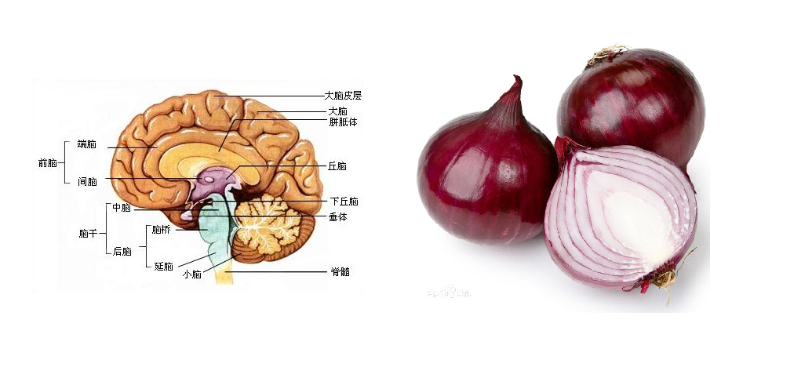   

### 基底核：   
回忆行为模式以及依此行动的核心，  
换言之，基底核甚至在大脑其他部分沉睡时都在存储生物的习惯。  

>实验：老鼠在迷宫中寻找巧克力，将寻找路线变成习惯性自动行为。   
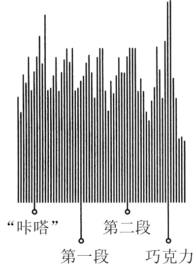
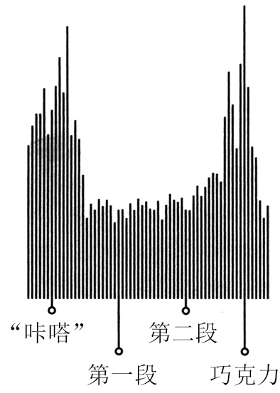  

### 这个过程被称为**组块化**：  大脑将一系列行为变成一种自动的惯常行为，而这是习惯形成的基础。

我们每天的生活靠的就是这些行为组块。  
有些很简单——你在把牙刷放进嘴里之前会习惯性地抹牙膏上去；  
有些则复杂一些，比如穿衣服或者给孩子准备午餐。  

习惯之所以出现，是因为大脑一直在寻找可以省力的方式。

这种省力的本能是一大优势。  
工作高效的大脑需要的空间更少，人的头部也会更小，这样的孩子在出生时更容易，因此也会降低婴儿和母亲的死亡率。

### 人大脑的基底核发展出了一套聪明的系统，能够决定什么时候让习惯来取代其他活动模式，什么时候让组块行为开始或停止。   
   
波峰出现的时候,是大脑在决定将控制权让给习惯以及选择什么习惯的时候。  
在活动结束的时候出现了奖品，老鼠的大脑就会醒过来，然后做判断，确定所有的东西都在按照预期发展。  

### 大脑中的这个过程是一个由三步组成的回路。  
1. 存在着一个暗示，让大脑进入某种自动行为模式，并决定使用哪种习惯。  
2. 存在一个惯常行为，这可以是身体、思维或情感方面的。  
3. 奖赏，能让你的大脑辨别出是否应该记下这个回路，以备将来之用。  
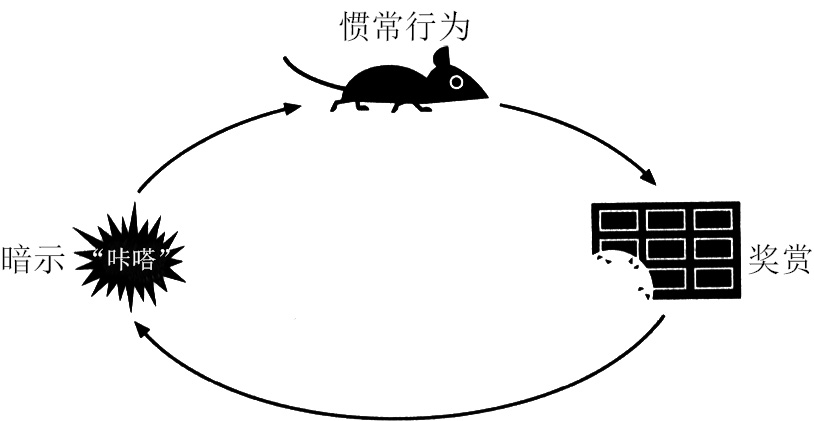   

这个由暗示、惯常行为、奖赏组成的回路变得越来越自动化。  
线索和奖赏交织在一起，直到强烈的参与意识与欲望出现。  
最终，习惯诞生了。  

### 习惯是脆弱的

习惯回路中  
* 暗示涵盖几乎所有事物，比如从视觉方面（像糖果条或者电视商业广告），到特定的地点、一天中的某个时间、某种情绪、一系列的思绪或者特定人的陪伴。   
* 习惯行为可以让人感受到不可思议的复杂，也可能令人觉得异常简单（有些习惯，比如和情绪有关的，都是在毫秒的尺度上测量的）。  
* 奖赏则涵盖了可以给感官带来快乐的食物、药物或情绪上的高潮，比如表演带给人的自豪感或者沾沾自喜的感觉。

### 寻找幸福的能力

## Chapter2 渴求的大脑
### 如何创造新习惯
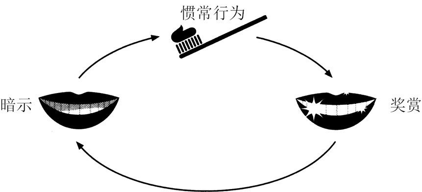   

### 霍普金斯的两条规律
心理基础：
1. 找出一种简单又明显的暗示。
2. 清楚地说明有哪些奖赏。

暗示——垢膜  
奖赏——漂亮的牙齿

对成功建立新锻炼习惯的人群的研究表明，如果他们选择一个具体的暗示，例如下班后尽快跑回家，或一个清晰的奖赏，例如一杯啤酒或者看一个晚上的电视而不必心怀内疚。  

关于节食减肥的研究表明，建立新的饮食习惯需要一个预设暗示，例如事先设定的菜单，以及为坚持节食的人们提供的简单奖赏。

光有霍普金斯的两条规律是不够的。要建立一种习惯，还必须满足第三条规律。这条规律是如此微小，以致霍普金斯本人在依赖这条规律的同时并没有意识到它的存在。它为所有现象提供了解释：从人为什么如此难以对一盒甜甜圈视而不见，到为何晨跑能变成一种几乎毫不费力的惯常行为。

### 纺必适的除异味策略

### 满足潜意识的成就感

为什么习惯如此强大：它们能够创造出神经渴求  

习惯只有在胡里奥看到暗示，开始渴求黑莓汁时，才会出现。  
一旦渴求存在，胡里奥就会自动开始行动。它会按照习惯回路行事。

### 习惯是这样产生的：   
把暗示、惯常行为和奖赏拼在一起，然后培养一种渴求来驱动这一回路。  

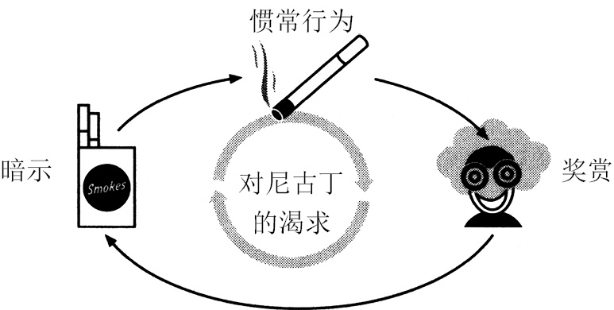  
   

当习惯特别强时会让人出现上瘾一样的反应，于是，“需求变成了让人沉溺其中的渴求”，这种变化让大脑进入了自动运转的状态，“甚至在丧失名誉、丢掉工作、无家可归和失去家人这样很强的抑制因素面前，也无法停止”。

要控制这种习惯，我们必须找出在背后驱动人们行为的渴求究竟是哪种。  
如果我们意识不到自己的大脑会出现这种预期，就会成为那些被看不见的力量拖着走进辛那邦糕饼店的消费者。

如果你想在每天起来晨跑，那你就得选择一个简单的暗示（比如吃早餐前系好跑鞋的鞋带或者把运动衣放在床边）和一个清晰的奖赏（作为一天之中的奖励，可以通过记录你的运动英里数来获得成就感，或者在跑步中产生大量的内啡肽）  
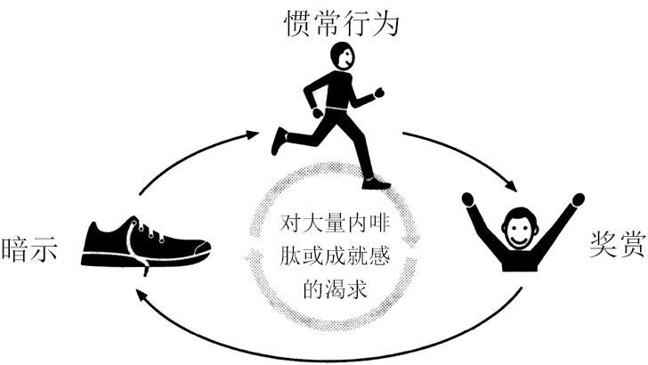   
暗示加上奖赏本身并不足以让新习惯长期持续。  
只有当你的大脑开始预期奖赏，渴求内啡肽的分泌或成就感时，你才会自觉地在每天早上系好跑鞋鞋带。  
而暗示除了能够触发惯常行为，还必须能够触发人对即将到来的奖赏的渴求。  

### 渴求驱动习惯
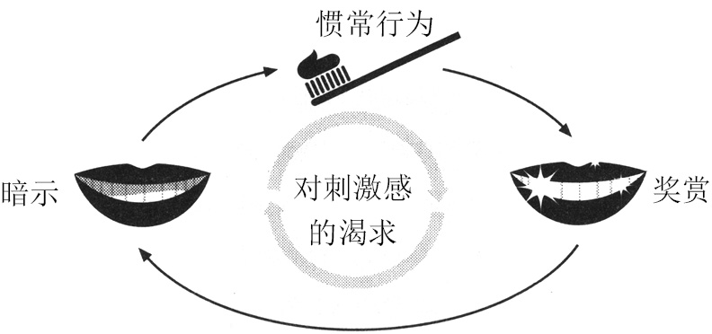  

想多加运动？选择一个暗示（比如每次一醒来就去健身房），然后找一个奖赏（比如每次健身后来一杯奶昔）。  
想想奶昔或者你会感觉到身体里涌出的内啡肽。让自己去预期奖赏的出现，最终，这种渴求会让你每天更想去健身。

最成功的节食者为自己的食谱构想了一个特定的奖赏，比如一件想穿的比基尼或者他们每天站在秤上看到体重下降带来的自豪感，这种奖赏是他们选择的，也是他们真心想要的。  
科研人员发现节食者对奖赏的渴求将诱惑挤出了食谱，这种渴求驱动着他们的习惯回路。  

泡沫是一种巨大的奖赏，洗澡用的香波没有泡沫，但是我们加入了起泡的化学物质，因为大家每次都预期自己在洗头发时会有泡沫。洗衣剂也是同样的道理，还有牙膏，现在所有的公司都在牙膏里加入了月桂醇聚醚硫酸酯钠，目的就是增加牙膏的泡泡。这种东西不会让牙齿更干净，但是当使用者的嘴边出现一堆泡沫时，他们的感觉会更好。    

一旦顾客开始预期刷牙时会出现泡沫，习惯就形成了。   

是渴求在驱动着习惯。找到触发渴求的方式让创造新习惯变得更容易。     

## Chapter3 习惯改变的黄金法则
#### 为什么习惯会发生变化

海盗队：不是创造新习惯，而是改变球员的旧习惯

### 改变习惯黄金法则
必须留住旧习惯回路中的暗示，   
提供旧习惯回路中的奖赏，  
但要插入一个新的惯常行为。   
如果暗示和奖赏不变，几乎所有的习惯都是可以被改变的。  
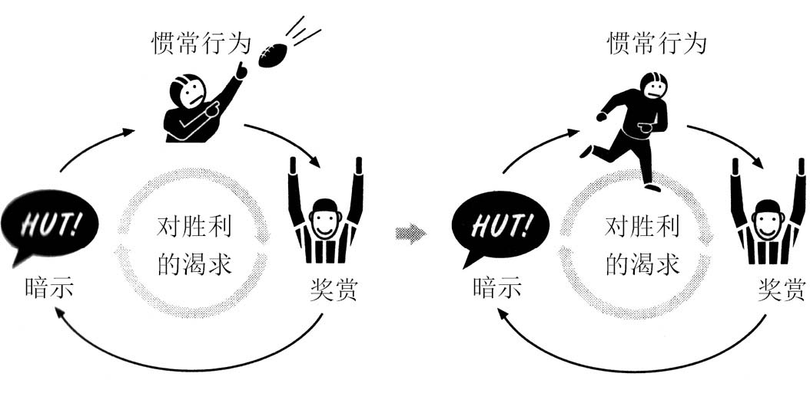  

留住暗示，提供同样的奖赏，插入新的惯常行为    
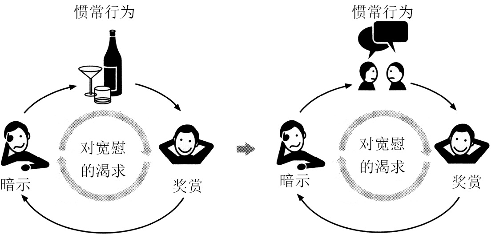   

一旦你意识到你习惯的运作方式，一旦认清习惯的暗示和回报，那么，改变习惯就成功了一半。

在有意寻找驱动我们行为的渴求感之前，我们通常并不真正理解它们。  

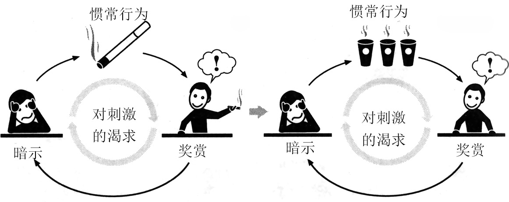   

如果你找到了暗示和奖赏，就能够改变惯常行为。  
至少，在大多数情况下是这样。  
不过，对有些习惯来说，如果想改变它们，还有一个因素非常必要，那就是信仰。

### 你眼睛看着哪里？  

### 习惯不能被消除，只能被替代

这种习惯替代对于多数人有效，但当生活的压力太大的时候，他们就会旧瘾复发。  

只有当作为替代的习惯和其他因素配合时，这些习惯才会永久持续。  

起作用的并不是上帝，而是信仰本身。  
一旦人们学会信仰某种东西，这种信仰就会扩展到生活的其他方面，直到他们开始相信自己能改变。  

